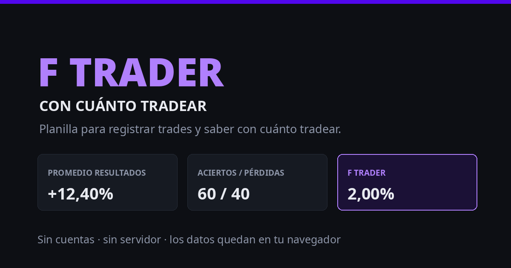

# F Trader — Con cuánto tradear

**[Español](#español) · [English](#english)**

Una planilla de trades que calcula cuánto capital conviene arriesgar en cada
operación, a partir de los resultados que ya registraste. Funciona entera en el
navegador: ningún servidor hace las cuentas, no se crea ninguna cuenta y no se
envía nada a ningún lado.



---

## Español

### Qué es

*F trader* es la cifra que da nombre al proyecto: la fracción del capital que la
fórmula sugiere arriesgar por trade, deducida de tu propio historial — porcentaje
de aciertos, relación entre la ganancia media y la pérdida media, y el RRR.

Empezó como una planilla de LibreOffice/Excel (`REGISTRO-TRADES.xlsm`) cuyas macros
habían dejado de funcionar: estaban escritas mitad en VBA y mitad en LibreOffice
Basic, y dos de las estadísticas principales eran `#REF!`. Esto es esa planilla
reconstruida como página, con lo roto arreglado en vez de reproducido.

En español e inglés, según el idioma del navegador.

### Cómo se usa

Abrí `index.html`. Esa es toda la instalación: funciona con doble clic, sin
servidor y sin paso de compilación.

1. **Datos del exchange** — comisiones, tipo de contrato y formato de numeración.
2. **Posiciones** — cargá trades en papel o reales. Las columnas calculadas se
   completan solas.
3. **Resultados y fórmulas** — aciertos y pérdidas, promedio, y *F trader*.

Los trades se guardan solos en `localStorage`, es decir **este navegador, este
dispositivo**. Para llevarlos a otro lado están el archivo cifrado y el enlace.

#### Importar una planilla que ya tenés

El botón del portapapeles abre *importar*: copiá las celdas en tu planilla y
pegalas ahí. No se lee ningún archivo — el portapapeles entrega filas separadas
por tabulaciones venga de donde venga, así que funciona igual desde LibreOffice,
Excel, Google Sheets, `.xlsx`, `.xlsm` y `.ods`. El `.xls` viejo queda afuera a
propósito: exportá a cualquiera de los otros.

El diálogo te deja decir qué columna es cada campo, y elegir **una sola vez para
toda la importación** si `60.000` son sesenta mil o sesenta, y si `01/09` es 1 de
septiembre o 9 de enero. Debajo de cada celda se muestra cómo quedó leída, así
una lectura equivocada se ve antes de confirmar. Las filas se agregan a las que
ya están: nada se reemplaza y nada se pierde. Una fila sin fecha legible se
saltea en vez de quedar fechada hoy, que la escondería en el mes equivocado.

### Apalancamiento: tope de 20x

`X` no acepta más de **20x**, y el tope se aplica al escribir, al pegar una
planilla y al cargar datos guardados antes de que existiera.

No es el límite de ningún exchange — varios ofrecen 50x, 100x o más. Es una
convención nuestra, alineada con cómo entendemos el trading: por encima de 20x
el stop y la liquidación pasan a ser el mismo evento, el margen deja de absorber
el ruido normal del precio, y la fórmula termina sugiriendo un tamaño de
posición sobre una cuenta que no llega a la próxima operación. *F trader* existe
para que el tamaño sea sostenible; permitir 100x lo volvería una calculadora de
cuánto tarda una cuenta en quemarse.

Quien quiera otro tope tiene el código: es la constante `X_MAX` en `app.js`.

### Privacidad

- Sin backend, sin cuentas, sin analítica, sin pedidos a terceros. La página no
  carga nada de un CDN: los iconos van embebidos como sprite SVG.
- Los datos viven en el `localStorage` del navegador y no salen de ahí por su cuenta.
- La exportación se cifra con **AES-GCM 256** y **PBKDF2-SHA256** (600.000
  iteraciones), usando el WebCrypto del propio navegador. Si se pierde la
  contraseña el archivo se pierde: no hay recuperación, y ese es el punto.
- El enlace cifrado guarda su contenido en el *fragmento* de la URL, que el
  navegador nunca manda al servidor.

### Qué calcula

`R` es el retorno sobre el margen, así que el denominador depende del contrato:

| Contrato | Margen depositado en | R |
|---|---|---|
| Lineal (USDⓈ-M) | USDT | `(SALIDA − ENTRADA) / ENTRADA × X` |
| Inverso (coin-margined) | la cripto | `(SALIDA − ENTRADA) / SALIDA × X` |

Las comisiones se cobran **sobre el nocional**, una vez por lado: `tasa × X`. Una
tasa negativa es un *rebate* y suma al retorno. La planilla original las aplicaba
proporcionales a `R`, lo que hacía que las comisiones *achicaran* una pérdida; acá
está corregido.

Con `PAR = BTC` los precios se cargan y se muestran en satoshis, y se guardan en BTC.

### Desarrollo

```bash
node test.mjs      # o: npm test
```

196 comprobaciones sobre el cálculo, el parser decimal, las fechas, las
estadísticas, la importación, la serie del gráfico, el cifrado y la integridad
del marcado. Las pruebas no tienen copia
del código: importan tal cual todo lo que está arriba del marcador de frontera del
DOM en `app.js`, así que no pueden quedar desfasadas. Necesita Node 20 o más nuevo.

Lo que toca el DOM **no** está cubierto y necesita un navegador. Para mirarlo a
ojo, abrí `index.html?demo`: genera tres meses de trades de ejemplo, suficientes
para que las estadísticas, los avisos y el gráfico tengan algo que decir. Pisa lo
que haya en el navegador, así que primero pide confirmación.

### Archivos

| | |
|---|---|
| `index.html` | marcado, el sprite de iconos y los textos en español |
| `app.js` | lógica — primero lo que no toca el DOM, después lo que sí |
| `app.css` | estilos, claro y oscuro |
| `fonts/` | Inter Tight 400/600/800, del tema Headline de criptonautas.co, con su licencia OFL |
| `test.mjs` | las pruebas |
| `og.png` | imagen de previsualización |
| `preview.html` | página pública para los rastreadores cuando la app está detrás de auth |

### Despliegue

Copiá los archivos a un directorio y apuntá un servidor web ahí. Son archivos
estáticos: no hace falta PHP, ni un proceso, ni un puerto.

Conviene servirlos con una Content-Security-Policy estricta, porque la página no
necesita nada de afuera:

```
default-src 'none'; script-src 'self'; style-src 'self' 'unsafe-inline';
font-src 'self'; img-src 'self' data:; form-action 'none'; base-uri 'none';
frame-ancestors 'none'
```

`preview.html` existe para el caso en que la planilla quede detrás de un login:
un redirect no tiene cuerpo, así que el rastreador que arma la previsualización
no encuentra las etiquetas. Serví esa página con 200 en lugar de redirigir, y
dejá `og.png` y `fonts/` fuera del login.

Si lo forkeás, `og:url`, `og:image` y los enlaces de contacto apuntan a
`criptonautas.co`: cambialos en `index.html` y `preview.html`, y poné tu dirección
en `CORREO`, dentro de `app.js`.

### Licencia

[AGPL-3.0-or-later](LICENSE). Elegida a propósito: esto es una herramienta web, y
la obligación de la GPL se dispara con la *distribución*, que nunca ocurre cuando
alguien simplemente hospeda una copia modificada. La AGPL cierra ese hueco, así que
un fork ofrecido como servicio tiene que publicar sus cambios. Para una herramienta
cuya única promesa es que tus datos se quedan en tu navegador, esa verificabilidad
es justamente el punto.

Las fuentes de `fonts/` (Inter Tight) no están bajo AGPL: tienen su propia licencia,
SIL OFL 1.1, incluida en [`fonts/OFL.txt`](fonts/OFL.txt).

---

## English

### What it is

*F trader* is the figure the project is named after: the share of capital the
formula suggests risking per trade, derived from your own history — win rate, the
ratio between average win and average loss, and the RRR.

It started as a LibreOffice/Excel sheet (`REGISTRO-TRADES.xlsm`) whose macros no
longer ran — they had been written half in VBA and half in LibreOffice Basic, and
two of the headline statistics were `#REF!`. This is that sheet rebuilt as a page,
with the broken parts fixed rather than reproduced.

Spanish and English, chosen from the browser's language.

### Using it

Open `index.html`. That is the whole installation — double-clicking the file works,
no server and no build step.

1. **Exchange data** — fees, contract type and number format.
2. **Positions** — log paper or real trades. Computed columns fill themselves in.
3. **Results and formulas** — win/loss share, average result, and *F trader*.

Trades are saved automatically in `localStorage`, which means **this browser, this
device**. To keep them elsewhere, use the encrypted file or link.

#### Importing a sheet you already have

The clipboard button opens *import*: copy the cells in your spreadsheet and paste
them in. No file is ever read — the clipboard hands over tab-separated rows
whatever the source, so it works the same from LibreOffice, Excel, Google Sheets,
`.xlsx`, `.xlsm` and `.ods`. Legacy `.xls` is deliberately left out: export to any
of the others.

The dialog lets you say which column is which field, and choose **once for the
whole import** whether `60.000` is sixty thousand or sixty, and whether `01/09`
is 1 September or 9 January. Each cell shows what it was read as, so a wrong
reading is visible before you commit it. Rows are appended to the ones already
there: nothing is replaced and nothing is lost. A row with no readable date is
skipped rather than dated today, which would hide it in the wrong month.

### Leverage: capped at 20x

`X` will not take more than **20x**. The ceiling is applied as you type, when a
spreadsheet is pasted in, and to data saved before it existed.

It is not any exchange's limit — plenty offer 50x, 100x or more. It is our own
convention, and it matches how we read trading: past 20x a stop-out and a
liquidation become the same event, the margin stops absorbing ordinary price
noise, and the formula ends up sizing a position on an account that will not
reach the next trade. *F trader* exists to keep sizing survivable; allowing 100x
would turn it into a calculator for how fast an account burns.

Anyone who wants a different ceiling has the code: it is the `X_MAX` constant in
`app.js`.

### Privacy

- No backend, no accounts, no analytics, no third-party requests. The page loads
  nothing from a CDN; the icons are inlined as an SVG sprite.
- Data lives in your browser's `localStorage` and never leaves it on its own.
- Export is encrypted with **AES-GCM 256** and **PBKDF2-SHA256** (600,000
  iterations), via the browser's own WebCrypto. Lose the password and the file is
  gone — there is no recovery, and that is the point.
- The encrypted link keeps its payload in the URL *fragment*, which browsers never
  send to the server.

### What it computes

`R` is the return on margin, so the denominator depends on the contract:

| Contract | Margin posted in | R |
|---|---|---|
| Linear (USDⓈ-M) | USDT | `(EXIT − ENTRY) / ENTRY × X` |
| Inverse (coin-margined) | the crypto | `(EXIT − ENTRY) / EXIT × X` |

Fees are charged **on notional**, once per side: `rate × X`. A negative rate is a
rebate and adds to the return. The original sheet applied them proportionally to
`R`, which made commissions *shrink* a losing trade — that is fixed here.

With `PAIR = BTC` prices are entered and shown in satoshis, and stored as BTC.

### Development

```bash
node test.mjs      # or: npm test
```

196 checks covering the calculation, the decimal parser, dates, statistics,
importing, the chart series, encryption and markup integrity. There is no copy of the source in the tests:
everything above the DOM boundary marker in `app.js` is imported as it ships, so
the tests cannot drift. Needs Node 20+.

Anything touching the DOM is **not** covered and needs a browser. To look at it
by eye, open `index.html?demo`: it generates three months of sample trades,
enough for the statistics, the warnings and the chart to have something to say.
It overwrites whatever is in the browser, so it asks first.

### Files

| | |
|---|---|
| `index.html` | markup, the icon sprite and the Spanish copy |
| `app.js` | logic — DOM-free code first, then everything that touches the document |
| `app.css` | styles, light and dark |
| `fonts/` | Inter Tight 400/600/800, from the criptonautas.co Headline theme, with its OFL licence |
| `test.mjs` | the test suite |
| `og.png` | link preview image |
| `preview.html` | public page served to crawlers when the app sits behind auth |

### Deploying

Copy the files to a directory and point a web server at it. They are static
files: no PHP, no process, no port.

Serve them with a strict Content-Security-Policy — the page needs nothing from
outside:

```
default-src 'none'; script-src 'self'; style-src 'self' 'unsafe-inline';
font-src 'self'; img-src 'self' data:; form-action 'none'; base-uri 'none';
frame-ancestors 'none'
```

`preview.html` is there for the case where the sheet sits behind a login: a
redirect has no body, so the crawler that builds the link preview finds no tags.
Serve that page with a 200 instead of redirecting, and keep `og.png` and
`fonts/` outside the login.

If you fork this, note that `og:url`, `og:image` and the contact links point at
`criptonautas.co` — change them in `index.html` and `preview.html`, and set
`CORREO` in `app.js` to your own address.

### Licence

[AGPL-3.0-or-later](LICENSE). Chosen deliberately: this is a web tool, and the
GPL's obligation is triggered by *distribution*, which never happens when someone
merely hosts a modified copy. The AGPL closes that gap, so a fork offered as a
service has to publish its changes. For a tool whose whole claim is that your data
stays in your browser, that verifiability is the point.

The fonts in `fonts/` (Inter Tight) are not AGPL: they carry their own SIL OFL 1.1
licence, included in [`fonts/OFL.txt`](fonts/OFL.txt).
